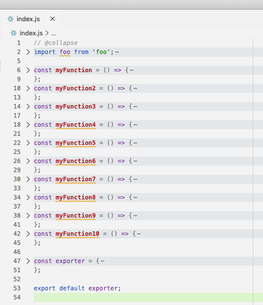

# Auto Collapse Blocks - VS Code Extension

This is the README for extension "auto-collapse-blocks" in VS Code. This extension allows you to add `@collapse` annotation to the top of your code file and auto-magically collapse all code blocks within that file.

## Features

> Tip: Only the language file listed below will work with this extension, for more language support, please submit an issue and we will add them shortly!

- `.js`
- `.ts`
- `.css`
- `.scss`
- `.md`

## Extension Settings

This extension will listen on file open/changed/focus to enforce auto collapsing.

## Release Notes

### 1.0.0

Initial release, with basic language supports for

- `.js`
- `.ts`
- `.css`
- `.scss`
- `.md`

- README updates

---

### For more information

- If you found an issue with this extension, please submit an issue within this repo to bring it to our attention
- For more language support, please submit an issue and we will add them shortly!

**Enjoy!**
